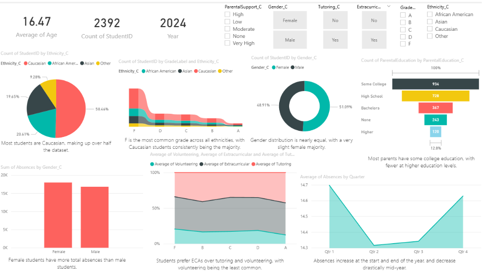
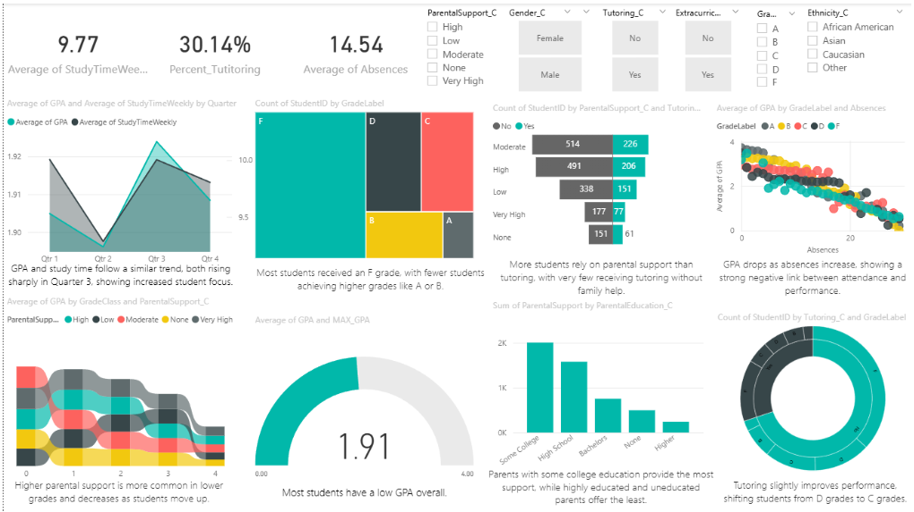
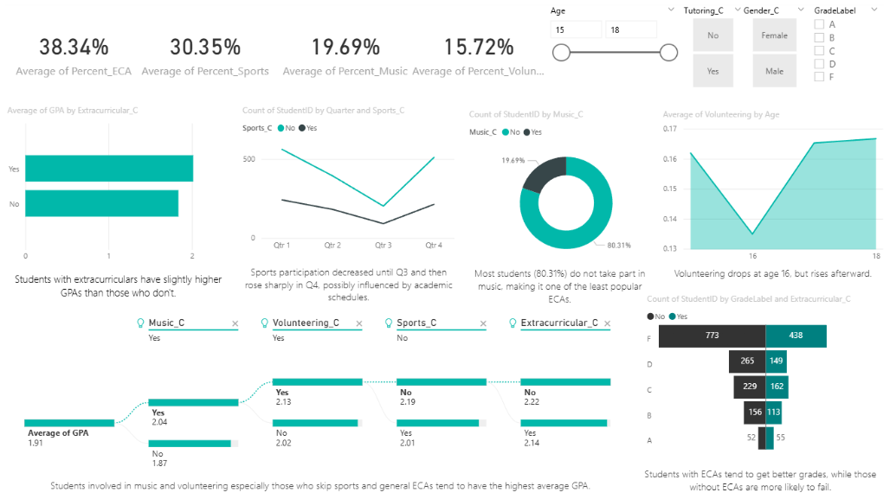
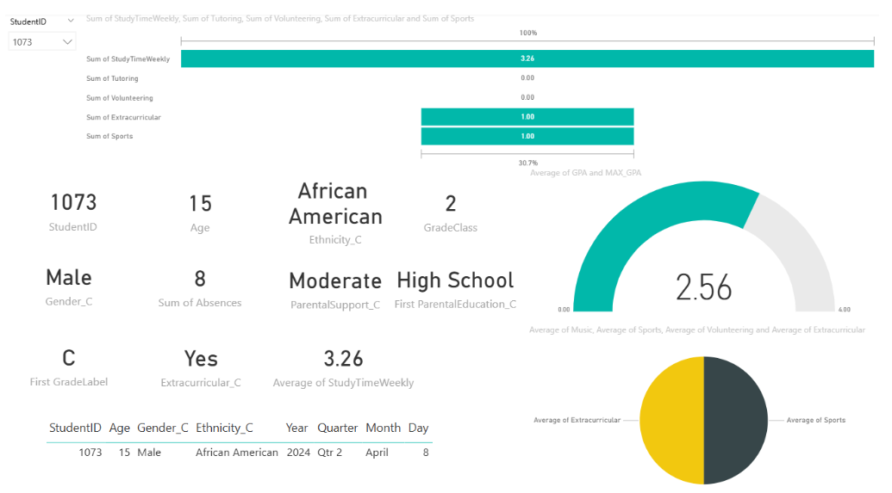

# Business Intelligence

**Assignment 03: Power BI Student Performance Dashboard**
**Spring 2025**

**Submitted by:**

* Kisa Fatima (ERP: 27076)
* Zuha Aqib (ERP: 26106)

**Date:** 9th May 2025

---

## Objective

The goal of this assignment was to use Power BI to analyze a rich dataset of high school student performance. The analysis aimed to explore how demographic factors, study habits, and extracurricular activities influence GPA, attendance, and grade outcomes. Through interactive dashboards and visual storytelling, the project seeks to assist academic institutions in making data-driven decisions to improve student success and engagement.

---

## About the Dataset

The dataset includes records for **2,392 students**, capturing detailed information across four main areas:

* **Demographics:** Gender, age, ethnicity, parental education level
* **Study Habits:** Study time, tutoring, absences, and parental support
* **Extracurricular Activities (ECAs):** Music, sports, volunteering
* **Academic Performance:** GPA and grade labels (A–F)

All data was verified for quality and consistency. No missing values were found, and proper data types were confirmed (e.g., categorical vs. numeric). Custom mappings were used to make fields more readable (e.g., 0 → Male, 1 → Female) and GPA scores were translated into standard letter grades.

---

## Problem Statement

The key objective was to analyze how different factors affect student outcomes. Specifically:

* Do extracurricular activities boost academic performance?
* What role does parental support play in student success?
* How do absence rates affect GPA?
* Are there demographic trends in grades and performance?
* Can we build a drill-down view for personalized insights?

---

## Data Preparation Steps

* **Verified Data Types:** Ensured GPA, age, test scores, and absences were numerical; others were categorical.
* **No Missing Data:** Verified using `df.isnull().sum()` – no imputation was required.
* **Profiled the Dataset:** Used `describe()` to understand GPA distribution, test scores, and category frequencies.
* **Created Grade Categories:** Mapped GPA to A–F labels for easier interpretation.
* **Cleaned Categorical Values:** Converted binary and encoded fields (e.g., 0/1 for gender, ECA) to human-readable labels.

---

## Power BI Report Structure

The Power BI report was divided into four comprehensive pages:

### 1. **Demographics Page**

* Visuals: Bar charts, funnel charts, ribbon and area charts.
* Focus: Student breakdown by **gender**, **ethnicity**, **parental education**, and **absences**.
* Key Insight: Female students had higher absence totals. Caucasian students formed the largest ethnic group.

### 2. **Study Habits Page**

* Visuals: Line graphs, tornado charts, scatter plots, treemaps.
* Focus: **Study time**, **tutoring**, **parental support**, and **GPA patterns**.
* Key Insights:

  * Students with tutoring and parental support had a GPA \~2.39 (higher than average).
  * GPA drops sharply with increasing absences.
  * Parental support declines as students move to higher grades.

### 3. **Extracurricular Activities Page**

* Visuals: Donut charts, tree diagrams, tornado charts, line charts.
* Focus: Impact of **sports**, **music**, and **volunteering** on academic outcomes.
* Key Insights:

  * Students involved in ECAs generally had higher GPAs.
  * Volunteering was least common; sports had the highest participation.
  * GPA peaked among students who participated in music and volunteering but did not play sports or join general ECAs.
  * 80% of students did not participate in music-related activities.

### 4. **Student Performance Page (Drill-through)**

* Visuals: KPI cards, pie charts, funnel charts.
* Function: Enables user to **select a student by ID** and view a full profile:

  * **Demographics**
  * **Academic stats (GPA, grade, absences)**
  * **Participation in ECAs, tutoring, and parental support**
* Example Insight: One student had a GPA of 2.56, studied 3 hours/week, and was active in sports and other ECAs.

---

## Key Findings

* **GPA Trends:** Average GPA across students was **1.91**. GPA increased when students had both **tutoring and parental support**.
* **Absences Impact:** Strong negative correlation between absences and GPA.
* **Parental Involvement:** Most parental support came from parents with some college education; support declined as education level increased.
* **Extracurricular Influence:** ECAs positively influenced academic outcomes; however, volunteering showed no major impact on GPA.
* **Demographic Balance:** Gender distribution was balanced, with slightly more female students. Caucasian students formed 50% of the dataset.
* **Study Effort:** Average study time was 9–10 hours per week, with GPA and study time following similar quarterly trends.

---

## Interactive Features

* **Slicers across all pages** enabled users to filter by:

  * Gender
  * Ethnicity
  * Grade Label
  * Tutoring & Parental Support
  * ECA Participation
* **Drill-down reports** allowed deep dives into monthly and quarterly trends.

---

## Visual Highlights

* **Ribbon charts** to show grade distributions across ethnicities and class levels.
* **Scatter plots** for correlation analysis (e.g., GPA vs. absences).
* **Sunburst chart** to explore tutoring and grade combinations.
* **Treemaps** and **funnel charts** to show parental support and ECA hierarchy.
* **Donut charts** to show participation breakdowns (e.g., Music vs. No Music).
* **Line graphs** for trend tracking over time.

---

## Conclusion

This Power BI project provided a holistic, interactive exploration of student academic performance. The dashboards enabled a multi-dimensional understanding of how study habits, demographic factors, and extracurricular engagement influence GPA and grades. The drill-through page adds personalized insights at the individual student level, making this dashboard a powerful tool for educators and administrators to identify at-risk students, allocate resources wisely, and support student development.