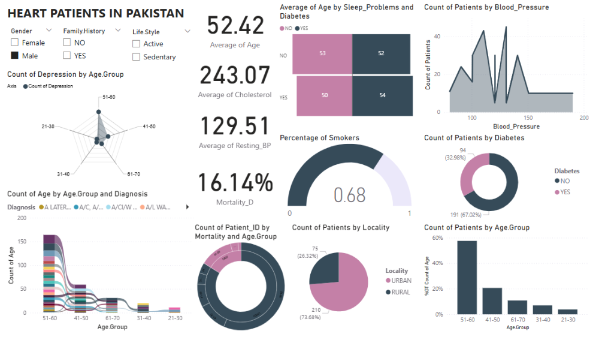

# Presentation
so here this was an assignment we got over the weekend in which we had to pair up, pick a dataset and then make a single 1 page dashboard with our pair. we also had to make a report. but then on the following class (monday), we had to present the dashboard in 5 minutes to our teacher - explaining it fully on what it was and what insight we gained. 

my partner was Kisa. 

# Power BI Heart Disease Analysis

**Business Intelligence – Spring 2025**   

**Group Members:**

* Kisa Fatima (ERP: 27076)
* Zuha Aqib (ERP: 26106)

**Submission Date:** April 27, 2025

## About the Dataset

The dataset used in this assignment is based on **heart patients in Pakistan**, including their demographics, medical history, and lifestyle habits. It contains variables such as **age**, **gender**, **cholesterol**, **blood pressure**, **diabetes**, **smoking**, **depression**, **locality**, **lifestyle**, and **mortality status**. The data enables analysis of risk factors and outcomes related to heart disease across different population segments.

## Problem Statement

This project explores the **relationship between health and lifestyle variables and heart disease outcomes**. The focus is to identify which age groups, conditions (like diabetes or sleep problems), and behaviors (e.g., smoking) are most commonly associated with mortality or poor health among heart patients in Pakistan. The goal is to generate insights that can be used for **public health planning**, **preventive strategies**, and **targeted interventions**.

## Work Contribution

* **Zuha Aqib:** 50% Power BI Dashboard, 50% Report
* **Kisa Fatima:** 50% Power BI Dashboard, 50% Report

## Dashboard Overview

The Power BI dashboard contains a wide range of visuals that help identify patterns in health indicators, mortality, and demographic data. These include:

* **KPIs**: Average age, average cholesterol, average blood pressure, mortality rate.
* **Visual Types Used**: Area Chart, Donut Chart, Bar Chart, Tornado Chart, Radar Chart, Gauge, Pie Chart, Sunburst, Ribbon Chart.
* **Focus Areas**: Mortality trends, diabetes and sleep problems, smoking patterns, gender-based comparisons, urban vs rural disparities, family history impact.

## Key Visual Insights

### Area Chart – Blood Pressure Distribution

* Most patients fall within **90–130** BP range.
* **Females** tend to have **higher BP**, while **males** peak at **110 and 130**.

### Donut Chart – Diabetes

* **46.2%** of all heart patients are diabetic.
* **91.57%** of female patients have diabetes vs. only **34%** of males.

### Bar Chart – Age Groups

* **51–60** is the largest age group for heart patients.
* Risk of heart disease rises **after age 50**, especially for **females 61–70**.

### Tornado Chart – Sleep Problems & Diabetes

* Patients with **both conditions** have highest average age (**57**).
* Males tend to show symptoms **earlier** than females.
* **Sedentary individuals** develop diabetes earlier (\~55), regardless of sleep.

### Radar Chart – Depression by Age

* Highest depression seen in **51–60**, then **61–70**.
* Female depression peaks in **61–70**, while male cases peak in **51–60**.

### Gauge Chart – Smoking

* **53%** of heart patients smoke.
* **68%** of male patients are smokers.
* Even **active individuals** show high smoking rates.

### Pie Chart – Urban vs Rural

* **71%** of patients are from **rural areas**.
* **Males** are more urban, **females** more rural.

### Sunburst Chart – Mortality by Age

* Most **deaths** occur in **41–70** age range.
* Female mortality is **near 50%**, highest in **61–70** group.
* Males die earlier (41–50), likely due to smoking/stress.

### Ribbon Chart – Age & Diagnosis

* 51–60 shows the **most diagnoses**, followed by 61–70.
* Younger groups have fewer diagnosis types.

## Insights Summary

1. **High Diabetes Overlap**

   * Nearly **half of heart patients have diabetes**, especially females (91%).
   * Diabetes must be managed as a comorbidity.

2. **Female Heart Risk in Rural Areas**

   * 71% of female patients are from rural zones.
   * Higher death rates, poor access to care.

3. **Age-Linked Risk**

   * Risk increases **after age 50**.
   * Programs should start **by age 40**.

4. **Smoking in Males**

   * 68% of male heart patients smoke.
   * Early deaths among males are linked to smoking and stress.

5. **Surprising Insight on Family History**

   * Patients **with family history** of heart disease had **lower mortality**, possibly due to awareness and early prevention.

## Knowledge Gained

* Heart disease spikes **after age 50**, especially in the **51–70** age range.
* **Diabetes and sleep issues** are dangerous when combined, especially for older **females**.
* **Smoking is a strong independent risk**, especially among urban males.
* Rural women are **severely underserved**, and face the **highest mortality**.
* Family history increases awareness, which lowers death rates.

## Actionable Recommendations

1. **Start Screening at Age 40**
   Launch early heart health screening for blood pressure, cholesterol, and diabetes.

2. **Combine Diabetes + Heart Health Programs for Women**
   Design joint medical programs for rural women to treat both issues together.

3. **Urban Male Anti-Smoking Campaigns**
   Focus on age 41–50 males with culturally relevant anti-smoking awareness.

4. **Expand Rural Clinics & Mobile Healthcare**
   Use mobile units and telehealth to reach rural females and underserved zones.

5. **Promote Preventive Checkups for All**
   Even people without family history must be educated to treat symptoms early.